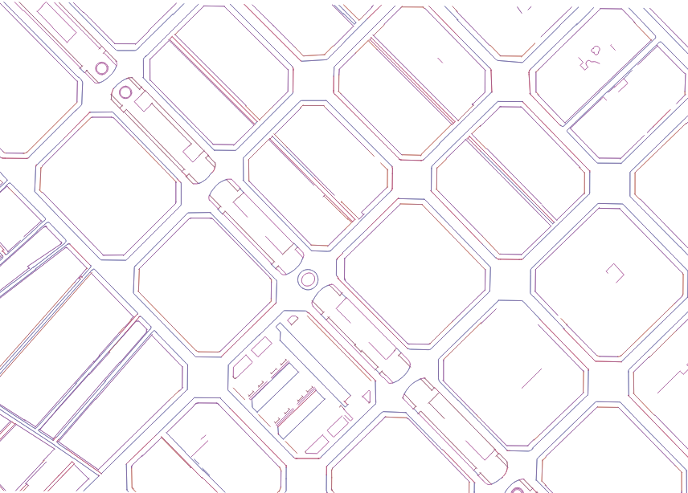

## Introduction

This report summarises the outputs of data reviews and analysis for the Mapping space between buildings Research.

## Summary table

The table shows an hyper-linked name of the output, a general comment and a snapshot of research outputs including tools and data diagnosis reports (draft and final version analysis). The table is organised according to estimated chronological order from newest to oldest.

+---+---------------------------------------------------------------------------------------------------------------------------------+-----------------------------------------------------------------------------------------------------------------------+----------------------------------------------------------------------------------------------------------------------------------------------------------------------------------------------------------------+
|   | Output                                                                                                                          | Comment                                                                                                               | Snapshot[.](https://Lorem/ipsum/dolor/sit/amet,/consectetur/adipiscing/elit,/sed/do/eiusmod/tempor/incididunt/ut/labore/et/dolore/magna/aliqua./Ut/enim/ad/minim/veniam,/quis/nostrud/exercitation/velit.html) |
+===+=================================================================================================================================+=======================================================================================================================+================================================================================================================================================================================================================+
| 3 |                                                                                                                                 |                                                                                                                       |                                                                                                                                                                                                                |
+---+---------------------------------------------------------------------------------------------------------------------------------+-----------------------------------------------------------------------------------------------------------------------+----------------------------------------------------------------------------------------------------------------------------------------------------------------------------------------------------------------+
| 2 |                                                                                                                                 |                                                                                                                       |                                                                                                                                                                                                                |
+---+---------------------------------------------------------------------------------------------------------------------------------+-----------------------------------------------------------------------------------------------------------------------+----------------------------------------------------------------------------------------------------------------------------------------------------------------------------------------------------------------+
| 1 | [Sample of Barcelona topographic data](https://github.com/npalomin/map-sbb/blob/main/data/sample_Barcelona_topographic.geojson) | Data is openly accessible from <http://www.icc.cat/appdownloads/?c=dlftopo1m#>                                        |                                                                                                                                                                                  |
|   |                                                                                                                                 |                                                                                                                       |                                                                                                                                                                                                                |
|   |                                                                                                                                 | Lines, points and polygons features are displayed with attributes that allow to derive curb lines (streetspace lines) |                                                                                                                                                                                                                |
+---+---------------------------------------------------------------------------------------------------------------------------------+-----------------------------------------------------------------------------------------------------------------------+----------------------------------------------------------------------------------------------------------------------------------------------------------------------------------------------------------------+
